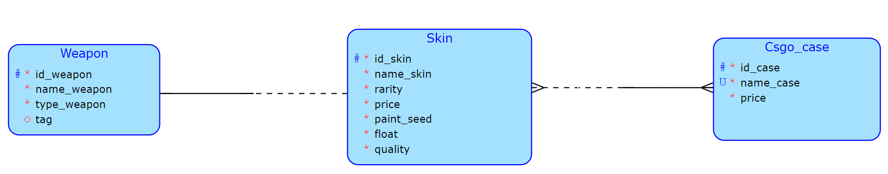

# BI-TJV semestrální práce

### Jak aplikaci spustit?
- `docker-compose up (--build)` (pro wsl možná nuto se sudo)
### Jak vyplnit tabulku základními daty (i pro reset)
- `docker exec -it semestralka-db-1 psql -U tjv -d tjv`
- tjv=# `\i /data.sql`

<b>Url webu:</b> http://localhost:5173/

## CSGO Skin Management System
Jedná se o částečný model aplikace, kde si hráči mohou prohlížet různé skiny a sledovat jejich cenu. Takových skinů a různých zbraní existuje mnoho, mimo to každý skin může mít rozlišné atributy, tak i jeho cena se může výrazně lišit, i když se předměty mohou zdát pro nezkušené oko totožné.

 

### Business operace
Byť skiny nejsou nutně unikátní, resp. může se stát, že se objeví 2 totožné skiny (primárně je rozeznáváme dle atributů name_skin, paint_seed a float), tak již ale není možné, že budou na stejné zbrani. Tedy je nutné zkontrolovat, zda se již daný skin (identifikován atributy name_skin, paint_seed a float) v naší databází nevyskytuje a pokud ano, tak je na jiné zbrani. 

 

### Komplexní dotaz
Např. vyhledej skiny, které mají raritu covert, jsou na zbrani AK-47 (rifle), stojí více jak 200€ a je možné je získat z Danger Zone case.

 
 

